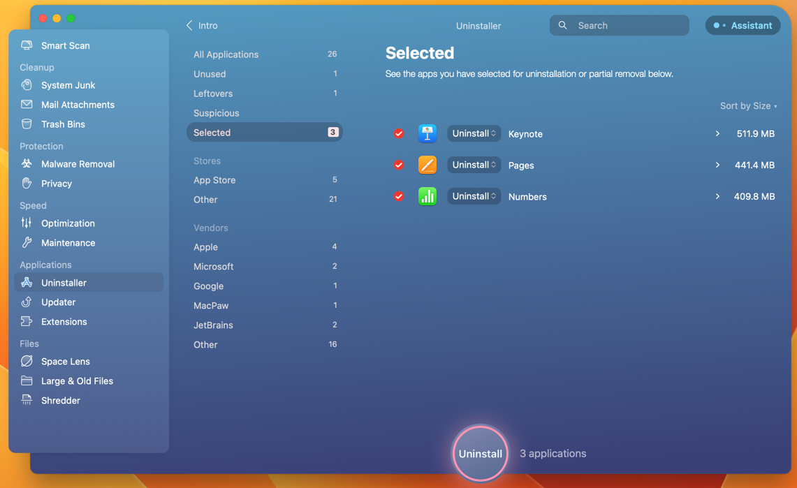

# Introduction

I wanted to document my setup process for a new Macbook to become for ready for development. So I tried to create this document.

I was focused on the following:
* Clean up the already shipped apps such as `GarageBand`, `iMovie`, etc.
* Install the apps I need for development such as `JetBrains products`, `iTerm`, etc.
  * And how to make it look nice using [Oh My Zsh](https://ohmyz.sh/) - never was an easy task for me 😮‍💨-
* Prepare the environment for development such as `Python`, `Node`, `Dotnet`, etc.
* Extra stuff that would enhance the experience such as `Podman`, `Postman`, etc.

And one of the main reasons I'm doing this is to have a reference for myself in the future, and to know 
what is the new apps that I should try out.

I was thinking of using [Ansible](https://www.ansible.com/) to automate the process, but I think it's an overkill for now.
Maybe in the future I will try it out.

## Web Browsers 🌐
Install your favorite browser, [Arc](https://arc.net/) is the new web browser in the neighborhood, and it's pretty cool give it a try if didn't already.

Or you can be a hipster and use [Brave](https://brave.com/). And Chrome, Firefox, Safari are still all good options.
## Install Homebrew 🍺
```sh
/bin/bash -c "$(curl -fsSL https://raw.githubusercontent.com/Homebrew/install/HEAD/install.sh)"
```
Alternatively, you can use their new `pkg` installer.
[https://github.com/Homebrew/brew/releases](https://github.com/Homebrew/brew/releases)

## Clean up 🧹
First thing, update the OS to the latest version.

Then, I will clean up the already shipped apps such as `GarageBand`, `iMovie`, `Keynote`, `Numbers`, etc.

I would use [CleanMyMac X](https://macpaw.com/cleanmymac) to do that. It's a paid app, but I think it's worth it - it has many other features -. 



