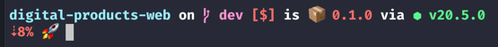
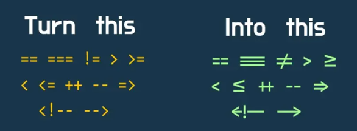

# Terminal Setup
This guide will help you set up your terminal to be more productive and developer-friendly.

# Zsh & Oh-My-Zsh
#### zsh
Almost all new macOS versions ship with zsh as the default shell, and it's a good thing, because it's more powerful than bash.
#### Oh-My-Zsh
> Oh My Zsh is a delightful, open source, community-driven framework for managing your Zsh configuration. It comes bundled with thousands of helpful functions, helpers, plugins, themes, and a few things that make you shout...

# Terminal Platform Options
While you can use the default terminal that ships with macOS, there are many other options that you can use, such as:
* [iTerm](https://iterm2.com/)
* [Hyper](https://hyper.is/)
* [Warp](https://warp.dev/)
* [Kitty](https://sw.kovidgoyal.net/kitty/)

# Install iTerm
In order to interact with the terminal using zsh, you need a terminal emulator.
```sh
brew install --cask iterm2
```

# Install Oh-My-Zsh
Why? In order to customize your terminal, and utilize all open-source plugins and themes. You need to install Oh-My-Zsh.
```sh
sh -c "$(curl -fsSL https://raw.github.com/ohmyzsh/ohmyzsh/master/tools/install.sh)"
```

# Install Spaceship Prompt
[Spaceship Prompt](https://spaceship-prompt.sh/) is a minimalistic, powerful and extremely customizable Zsh prompt.
Which runs on top of Oh-My-Zsh.

Okay, what exactly is a zsh prompt?  It's these extra details that you see before you start typing your commands.


Like the current directory, the git branch, the time, battery percentage - apparently that I am running out of battery 😅 - and many more customizations.

## 1️⃣ Install Fonts Pre-requisites
You need to have a Powerline patched font in order to properly display git branch symbol.
### Install Powerline Fonts
Install any Powerline compatible font like Fira Code from here:
https://www.nerdfonts.com/font-downloads

Or you can have a look into this font `monolisa`:
https://monolisa.dev/ which is a paid font, can you tell me if it's worth it?

### Configure iTerm to use the font
Then configure your iTerm profile - or any other terminal - to use that font.

```iTerm2 -> Preferences -> Profiles -> Text -> Font Section -> Select Font - after installing it -```


### ligatures
🚩 Check Use ligatures, so that you can have the fancy arrow.



### Natural Text Editing
🚩What is Natural Text Editing?
It's the ability to move the cursor by word using the Option key.

```iTerm2 -> Preferences -> Profiles -> Keys -> Load Preset... -> Natural Text Editing```


## 2️⃣ Install Spaceship Prompt
I used this dotfiles repo to install the Spaceship Prompt.
https://github.com/denysdovhan/dotfiles

It's a great repo, it automates the process of installing the Spaceship Prompt, and it has many other cool stuff.
It provides many features out of the box, and it's highly customizable.
Check out the repo for more details.

What I like about it:
* it has a proper structure for projects, and it's easy to navigate.

## 3️⃣ Themes
I am using the [Dracula](https://draculatheme.com/) theme, and I tend to use it everywhere.
You can find many other themes here:
https://iterm2colorschemes.com/

To activate the theme, go to:
* Click Color Presets... at the bottom right 
* Click Import... 
* Select the [theme_name].itermcolors file 
* Select the theme from Color Presets...